# Compliance Copilot Architecture

## System Architecture Diagram

```mermaid
graph TB
    %% User Interface Layer
    subgraph "Frontend Layer"
        UI[Next.js Frontend<br/>Port 3001]
        UI --> |User Interactions| MAIN[Main Page<br/>Compliance Interface]
        UI --> |Agent Status| AGENT_STATUS[AI Agents Status<br/>Background Processing]
    end

    %% Backend Services Layer
    subgraph "Backend Services"
        API[FastAPI Backend<br/>Port 8001]
        API --> |Contract Upload| UPLOAD[Contract Upload<br/>PDF Processing]
        API --> |Compliance Check| COMPLIANCE[Compliance Analysis<br/>Flag Detection]
        API --> |Risk Analysis| RISK[Risk Correlation<br/>Cross-document Analysis]
        API --> |Table Extraction| TABLES[Table Extraction<br/>Structured Data]
        API --> |Live Search| SEARCH[Pathway Search<br/>Real-time Indexing]
    end

    %% AI Agent Orchestration Layer
    subgraph "AI Agent Orchestration"
        ORCHESTRATOR[Agent Orchestrator<br/>Task Coordination]
        ORCHESTRATOR --> |Document Processing| DOC_AGENT[Document Processing Agent<br/>LandingAI Integration]
        ORCHESTRATOR --> |Search & Discovery| SEARCH_AGENT[Search & Discovery Agent<br/>Pathway Integration]
        ORCHESTRATOR --> |Compliance Analysis| COMPLIANCE_AGENT[Compliance Orchestrator Agent<br/>Multi-agent Coordination]
    end

    %% External AI Services
    subgraph "AI Services"
        LANDINGAI[LandingAI ADE<br/>Document Extraction]
        PATHWAY[Pathway Framework<br/>Real-time Processing]
        MCP_LANDINGAI[LandingAI MCP Server<br/>Document Tools]
        MCP_PATHWAY[Pathway MCP Server<br/>Search Tools]
    end

    %% Data Storage Layer
    subgraph "Data Storage"
        RULES[Compliance Rules<br/>Markdown Files]
        CONTRACTS[Contract Documents<br/>PDF/JSON Files]
        INDEX[Live Index<br/>Real-time Updates]
        CACHE[Response Cache<br/>Performance Optimization]
    end

    %% External Integrations
    subgraph "External Integrations"
        INKEEP[Inkeep Framework<br/>Agent Management]
        GITHUB[GitHub Repository<br/>Code Management]
    end

    %% Connections
    UI --> API
    API --> ORCHESTRATOR
    ORCHESTRATOR --> LANDINGAI
    ORCHESTRATOR --> PATHWAY
    DOC_AGENT --> MCP_LANDINGAI
    SEARCH_AGENT --> MCP_PATHWAY
    COMPLIANCE_AGENT --> MCP_LANDINGAI
    COMPLIANCE_AGENT --> MCP_PATHWAY
    
    LANDINGAI --> RULES
    LANDINGAI --> CONTRACTS
    PATHWAY --> INDEX
    PATHWAY --> RULES
    PATHWAY --> CONTRACTS
    
    API --> CACHE
    ORCHESTRATOR --> INKEEP
    
    %% Styling
    classDef frontend fill:#e1f5fe
    classDef backend fill:#f3e5f5
    classDef agents fill:#fff3e0
    classDef ai fill:#e8f5e8
    classDef data fill:#fce4ec
    classDef external fill:#f1f8e9
    
    class UI,MAIN,AGENT_STATUS frontend
    class API,UPLOAD,COMPLIANCE,RISK,TABLES,SEARCH backend
    class ORCHESTRATOR,DOC_AGENT,SEARCH_AGENT,COMPLIANCE_AGENT agents
    class LANDINGAI,PATHWAY,MCP_LANDINGAI,MCP_PATHWAY ai
    class RULES,CONTRACTS,INDEX,CACHE data
    class INKEEP,GITHUB external
```

## Component Details

### Frontend Layer
- **Next.js Application**: Modern React framework with server-side rendering
- **Main Interface**: Unified compliance analysis interface
- **Agent Status**: Real-time display of AI agent activity
- **Responsive Design**: Works on desktop and mobile devices

### Backend Services
- **FastAPI Backend**: High-performance Python API server
- **Contract Upload**: PDF document processing and validation
- **Compliance Analysis**: Automated flag detection and risk assessment
- **Risk Correlation**: Cross-document pattern analysis
- **Table Extraction**: Structured data extraction from documents
- **Live Search**: Real-time document search and indexing

### AI Agent Orchestration
- **Agent Orchestrator**: Central coordination system for all AI agents
- **Document Processing Agent**: Specialized in document extraction using LandingAI
- **Search & Discovery Agent**: Handles real-time search using Pathway
- **Compliance Orchestrator Agent**: Coordinates multiple agents for complex workflows

### AI Services
- **LandingAI ADE**: Advanced document extraction with DPT-2 model
- **Pathway Framework**: Real-time data processing and live indexing
- **MCP Servers**: Model Context Protocol servers for agent communication

### Data Storage
- **Compliance Rules**: Markdown files containing regulatory requirements
- **Contract Documents**: PDF and JSON contract files
- **Live Index**: Real-time searchable index of all documents
- **Response Cache**: In-memory caching for improved performance

### External Integrations
- **Inkeep Framework**: Agent management and coordination
- **GitHub Repository**: Version control and code management

## Data Flow

1. **User Upload**: Contract PDF uploaded through frontend
2. **Document Processing**: LandingAI extracts structured data
3. **Compliance Analysis**: AI agents analyze against rules
4. **Risk Assessment**: Cross-document correlation analysis
5. **Real-time Search**: Pathway provides live document search
6. **Results Display**: Formatted results shown to user

## Key Features

- **Real-time Processing**: Live document indexing and search
- **AI-Powered Analysis**: Advanced document understanding
- **Multi-agent Coordination**: Specialized agents for different tasks
- **Caching**: Performance optimization for repeated operations
- **Scalable Architecture**: Modular design for easy expansion
