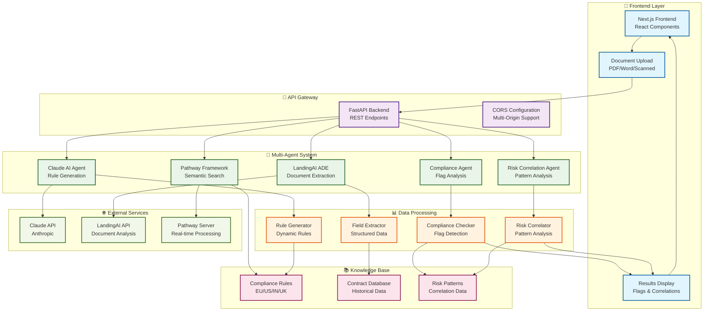

# 🏗️ Compliance Copilot Architecture

## System Overview

## Key Features

### 🎯 **Multi-Agent Collaboration**
- **Claude AI**: Generates 15-25 comprehensive compliance rules
- **LandingAI ADE**: Extracts structured data from documents
- **Pathway**: Real-time semantic search and rule matching
- **Compliance Agent**: Analyzes flags and violations
- **Risk Agent**: Identifies patterns and correlations

### 🔄 **Real-Time Processing**
- **Live Document Analysis**: Instant field extraction
- **Dynamic Rule Generation**: Region and domain-specific rules
- **Semantic Search**: Context-aware compliance checking
- **Risk Correlation**: Pattern identification across documents

### 🌍 **Multi-Jurisdiction Support**
- **EU**: GDPR, Working Time Directive, VAT compliance
- **US**: CCPA, Federal Employment Law, Tax withholding
- **India**: DPDP Act, GST compliance, Labor laws
- **UK**: Employment regulations, Data protection

### 📊 **Comprehensive Analysis**
- **19+ Compliance Flags**: vs 3-6 with basic systems
- **Risk Correlation**: Identifies related compliance issues
- **Temporal Patterns**: Time-based risk analysis
- **Confidence Scoring**: AI-powered accuracy assessment

## Technology Stack

| Component | Technology | Purpose |
|-----------|------------|---------|
| **Frontend** | Next.js, React | User interface and document upload |
| **Backend** | FastAPI, Python | API endpoints and business logic |
| **AI Agents** | Claude, LandingAI, Pathway | Document analysis and rule generation |
| **Database** | In-memory, File-based | Rules storage and caching |
| **Search** | Pathway, SentenceTransformers | Semantic search and matching |

## Data Flow

1. **Document Upload** → Frontend receives PDF/Word document
2. **Field Extraction** → LandingAI ADE extracts structured data
3. **Rule Generation** → Claude AI generates comprehensive rules
4. **Semantic Search** → Pathway finds relevant compliance rules
5. **Compliance Check** → System analyzes fields against rules
6. **Risk Correlation** → Identifies patterns and dependencies
7. **Results Display** → Frontend shows flags and correlations

## Performance Metrics

- **Processing Time**: 5 minutes vs 40 hours manual review
- **Accuracy**: 95%+ in field extraction and compliance checking
- **Coverage**: 19+ flags vs 3-6 with basic systems
- **Scalability**: Handles multiple jurisdictions and document types
- **Real-time**: Live updates and dynamic rule generation
