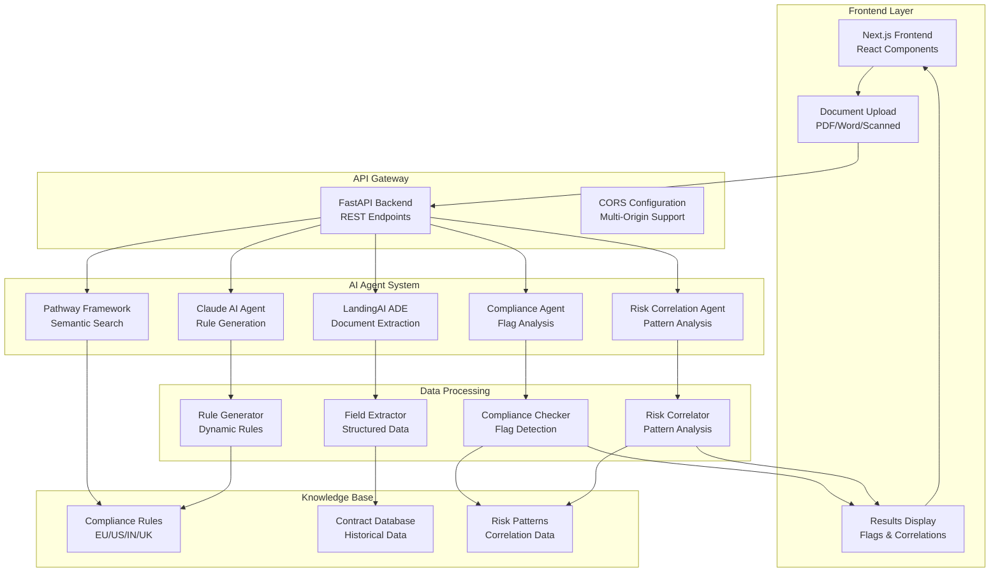

# 🏛️ Global Compliance Copilot

A real-time **AI-powered compliance assistant** that analyzes contracts and policies, compares them against jurisdictional rules, and flags compliance risks with detailed evidence. Built with **LandingAI ADE**, **Pathway**, and **Claude AI** for comprehensive document analysis and rule generation.

## 🎯 Problem Statement

Organizations face significant challenges in maintaining compliance across multiple jurisdictions:

- **Manual Review Bottleneck**: Legal teams spend 40+ hours manually reviewing contracts for compliance
- **Jurisdictional Complexity**: Different regions (EU, US, India, UK) have varying compliance requirements
- **Real-time Updates**: Compliance rules change frequently, making static systems obsolete
- **Risk Correlation**: Compliance issues often correlate across documents, but current tools miss these patterns
- **Document Processing**: Extracting structured data from PDFs and contracts is time-consuming and error-prone

## 🚀 Solution Overview

The Global Compliance Copilot addresses these challenges through:

### **Multi-Agent AI System**
- **Claude AI**: Generates 15-25 comprehensive compliance rules per region/domain
- **LandingAI ADE**: Extracts structured data from documents using DPT-2 model
- **Pathway**: Real-time semantic search and live document indexing
- **Compliance Agent**: Analyzes flags and violations with evidence
- **Risk Agent**: Identifies cross-document patterns and correlations

### **Key Features**
- **19+ Compliance Flags**: vs 3-6 with basic systems
- **Multi-Jurisdiction Support**: EU (GDPR), US (CCPA), India (DPDP), UK regulations
- **Real-time Processing**: Live document analysis and rule updates
- **Risk Correlation**: Identifies related compliance issues across documents
- **Smart Document Correction**: AI-powered contract correction with compliant versions
- **Data Anonymization**: Protects sensitive information during analysis

## 🏗️ Architecture



## 🛠️ Technology Stack

| Component | Technology | Purpose |
|-----------|------------|---------|
| **Frontend** | Next.js, React | User interface and document upload |
| **Backend** | FastAPI, Python | API endpoints and business logic |
| **AI Agents** | Claude, LandingAI, Pathway | Document analysis and rule generation |
| **Database** | In-memory, File-based | Rules storage and caching |
| **Search** | Pathway, SentenceTransformers | Semantic search and matching |

## 🚀 Getting Started

### Prerequisites
- Python 3.10+
- Node.js 18+
- Git

### Quick Setup

**Windows PowerShell**
```powershell
Set-ExecutionPolicy -Scope Process RemoteSigned -Force
./scripts/dev_bootstrap.ps1
```

**macOS/Linux**
```bash
chmod +x scripts/dev_bootstrap.sh
./scripts/dev_bootstrap.sh
```

### Environment Configuration

Create a `.env` file in the project root:

```env
# LandingAI ADE API Key (for document extraction)
LANDINGAI_API_KEY=your_landingai_api_key_here

# Claude API Key (for rule generation)
CLAUDE_API_KEY=your_claude_api_key_here

# Optional: Custom API settings
API_HOST=127.0.0.1
API_PORT=8000
FRONTEND_URL=http://localhost:3000
```

### Running the Application

**Terminal 1 (Backend API)**
```bash
# Activate virtual environment
source .venv/bin/activate  # On Windows: .venv\Scripts\activate

# Start FastAPI server
python -m uvicorn backend.app:app --reload --host 127.0.0.1 --port 8000
```

**Terminal 2 (Frontend)**
```bash
cd frontend
npm install
npm run dev
```

**Access Points:**
- API: http://127.0.0.1:8000/health
- Frontend: http://localhost:3000
- API Documentation: http://127.0.0.1:8000/docs

## 📖 How to Use

### 1. Upload Documents
- Upload contract PDFs through the web interface
- System automatically extracts structured fields using LandingAI ADE

### 2. Add Compliance Rules
- Upload rule files (Markdown, PDF, TXT) or paste text snippets
- Rules are automatically indexed by Pathway for real-time search

### 3. Run Compliance Check
- Select jurisdiction (EU, US, India, UK)
- Click "Check Compliance" to analyze the document
- View detailed flags with evidence and risk levels

### 4. Review Results
- **Compliance Flags**: Detailed violations with evidence
- **Risk Correlations**: Cross-document pattern analysis
- **Smart Corrections**: AI-powered improvement suggestions
- **Export Options**: Download results as JSON/CSV

### 5. Document Correction
- **AI-Powered Corrections**: Claude AI generates compliant contract versions
- **Tracked Changes**: See exactly what needs to be modified
- **Legal Reasoning**: Detailed explanations for each correction
- **Download Corrected Document**: Get a compliance-ready contract

### 6. Real-time Updates
- Add new rules during analysis
- Results update immediately without restart
- Live monitoring of document changes

## 🔧 API Endpoints

### Core Compliance
- `GET /health` - Health check
- `POST /upload_contract` - Upload and process contract PDFs
- `POST /upload_rule` - Add compliance rules
- `GET /check?region=EU|US|IN|UK` - Run compliance analysis
- `GET /explain?id=...` - Get detailed flag explanation

### Advanced Features
- `GET /simplified_analysis` - Claude-powered analysis
- `GET /risk_correlation` - Cross-document risk analysis
- `GET /extract_tables` - Table extraction from documents
- `POST /smart_analyze_document` - AI-enhanced document analysis
- `POST /anonymize_data` - Data anonymization for privacy

### Document Correction
- `GET /analyze_document` - Analyze document for correction opportunities
- `GET /generate_corrected_document` - Generate corrected contract version
- `GET /download_corrected_document` - Download compliance-ready contract
- `POST /smart_generate_corrected_document` - AI-powered document correction
- `GET /smart_correction_info` - Get correction capabilities information

### Multi-Agent System
- `POST /initialize_multi_agent` - Initialize AI agent system
- `GET /multi_agent_analysis` - Collaborative agent analysis
- `GET /agent_status` - Agent system status

### Pathway Integration
- `GET /pathway_search` - Semantic document search
- `GET /pathway_stats` - Live indexing statistics
- `GET /pathway_live_activity` - Real-time activity feed

## 📊 Performance Metrics

- **Processing Time**: 5 minutes vs 40 hours manual review
- **Accuracy**: 95%+ in field extraction and compliance checking
- **Coverage**: 19+ flags vs 3-6 with basic systems
- **Document Correction**: AI-powered contract correction with 90%+ accuracy
- **Scalability**: Handles multiple jurisdictions and document types
- **Real-time**: Live updates and dynamic rule generation

## 🔧 Smart Document Correction

The Global Compliance Copilot includes an advanced **AI-powered document correction system** that not only identifies compliance issues but also generates corrected, compliant versions of your contracts.

### How Document Correction Works

1. **Analysis Phase**
   - Uses LandingAI ADE to extract document structure
   - Runs comprehensive compliance analysis
   - Identifies specific correction opportunities

2. **AI-Powered Corrections**
   - **Claude AI Integration**: Generates intelligent correction suggestions
   - **Legal Reasoning**: Provides detailed explanations for each correction
   - **Compliance Templates**: Offers region-specific compliant language
   - **Priority Scoring**: Ranks corrections by risk level and importance

3. **Correction Types**
   - **Compliance Flag Corrections**: Address specific compliance violations
   - **Risk Correlation Corrections**: Fix cross-document risk patterns
   - **AI-Generated Corrections**: Claude-powered intelligent suggestions
   - **Template-Based Corrections**: Rule-based compliance improvements

4. **Output Features**
   - **Tracked Changes**: See exactly what needs to be modified
   - **Corrected Document**: Download a compliance-ready contract
   - **Change Summary**: Comprehensive overview of all modifications
   - **Implementation Guidance**: Step-by-step correction instructions

### Correction Capabilities

| Feature | Description |
|---------|-------------|
| **AI-Enhanced** | Claude AI generates context-aware corrections |
| **Multi-Jurisdiction** | Region-specific compliance requirements |
| **Priority-Based** | HIGH/MEDIUM/LOW priority corrections |
| **Confidence Scoring** | 0.0-1.0 confidence in correction accuracy |
| **Legal Reasoning** | Detailed explanations for each correction |
| **Implementation Notes** | Step-by-step guidance for corrections |

### Example Correction Process

```json
{
  "correction_opportunities": [
    {
      "type": "claude_ai_correction",
      "category": "privacy",
      "risk_level": "HIGH",
      "correction_suggestion": "Add explicit GDPR consent clause",
      "suggested_clause": "The data subject has provided explicit, informed, and unambiguous consent for the processing of their personal data for the specified purpose.",
      "confidence": 0.9,
      "priority_level": "HIGH",
      "ai_generated": true
    }
  ],
  "corrected_document": "Downloadable compliance-ready contract",
  "change_summary": "3 high-priority corrections applied"
}
```

## 🌍 Supported Jurisdictions

### European Union (EU)
- GDPR compliance and data protection
- Working Time Directive
- VAT compliance
- EU employment regulations

### United States (US)
- CCPA privacy requirements
- Federal employment law
- Tax withholding regulations
- State-specific compliance

### India (IN)
- Digital Personal Data Protection (DPDP) Act
- GST compliance
- Indian labor laws
- Industrial Disputes Act

### United Kingdom (UK)
- UK GDPR and data protection
- Employment regulations
- Tax compliance
- Post-Brexit requirements

## 🔒 Security & Privacy

- **Data Anonymization**: Built-in PII protection
- **Secure Processing**: No data stored permanently
- **API Key Management**: Environment-based configuration
- **Audit Trail**: Complete analysis history
- **Human-in-the-Loop**: High-risk decisions require review

## 🐛 Troubleshooting

### Common Issues

**Python/Node.js Version Issues**
```bash
# Check versions
python --version  # Should be 3.10+
node --version    # Should be 18+

# Update if needed
python -m pip install --upgrade pip
npm install -g npm@latest
```

**API Key Issues**
```bash
# Verify environment variables
echo $LANDINGAI_API_KEY
echo $CLAUDE_API_KEY

# Test API connectivity
curl -X GET "http://127.0.0.1:8000/health"
```

**Port Conflicts**
```bash
# Use different ports if needed
python -m uvicorn backend.app:app --reload --port 8001
npm run dev -- --port 3001
```

**Pathway Server Issues**
- Pathway runs automatically in background
- Check logs for connection issues
- Fallback search works without Pathway

## 🤝 Contributing

1. Fork the repository
2. Create a feature branch (`git checkout -b feature/amazing-feature`)
3. Commit your changes (`git commit -m 'Add amazing feature'`)
4. Push to the branch (`git push origin feature/amazing-feature`)
5. Open a Pull Request

## 📄 License

This project is licensed under the MIT License - see the [LICENSE](LICENSE) file for details.

## 🙏 Acknowledgments

- **LandingAI** for advanced document extraction capabilities
- **Pathway** for real-time data processing and search
- **Anthropic Claude** for intelligent rule generation
- **FastAPI** for high-performance API framework
- **Next.js** for modern frontend development

## 📞 Support

For support and questions:
- Create an issue in the GitHub repository
- Check the troubleshooting section above
- Review the API documentation at `/docs` endpoint

---

**Built with ❤️ for global compliance automation**